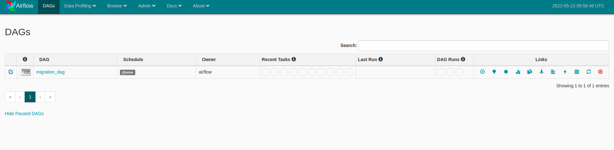
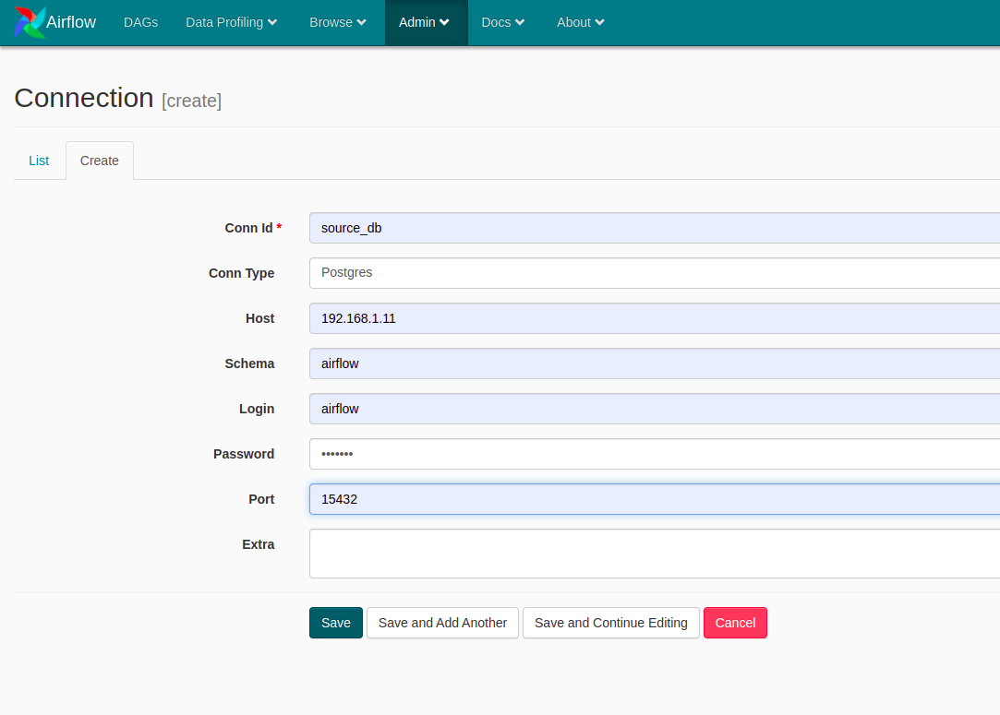
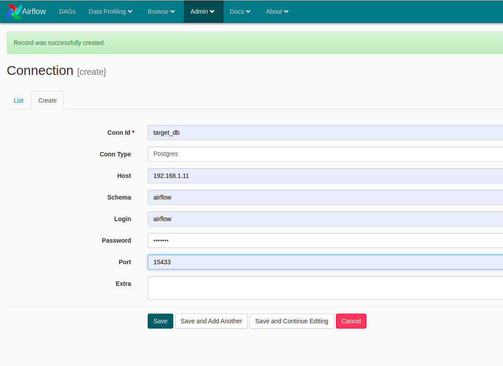
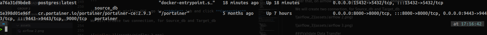
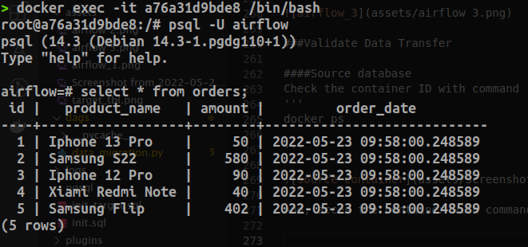
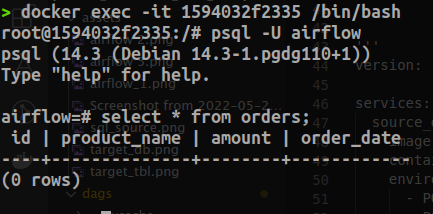
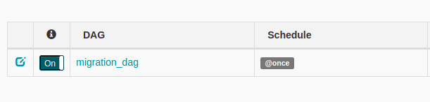
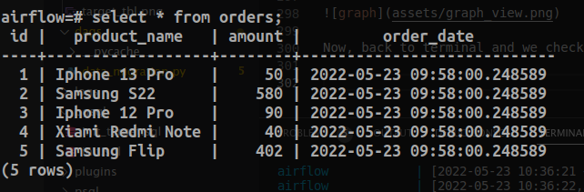

## Disclaimer
This repository is made for technical assesment as Data Engineer at Glints.

## About Assignment
Good Day,

Thank you for applying for the position of Data Engineer at Glints.
The following describe the Technical Assessment requirement for this position.

### Problem Set
A key part of a Data Engineer’s responsibilities is maintaining the serviceability of Data Warehouse. To achieve this, you will need to understand the set up and operation of a basic Data Warehouse.

In this technical assessment, you are required to submit the setup for the data pipeline of a basic data warehouse using Docker and Apache Airflow.

Your final setup should include the following:
- A source postgres database (Database X)
- A target postgres database (Database Y, which is not the same Docker container as Database X)
- Apache Airflow with webserver accessible from localhost:5884
- A Directed Acyclic Graph (DAG) for transferring the content of Source Database X to Target Database Y
- README.md detailing the usage of your submission

As the focus of this technical assessment is on the set up of a basic data pipeline using Airflow, the content of the table in Source Postgres Database X to be transferred can be determined by the candidate. It can be as basic as:

| id | creation_date | sale_value |
| -- | :-------------: | ---------- |
| 0  | 12-12-21 | 1000 |
| 1  | 13-12-21 | 2000 |

### Proble Solving

First, we will build docker container use docker-compose. By using docker-compose we will create 3 container:

1. Postgres for Source DB
2. Postgres for Target DB
3. Airflow (Include Web Server and Scheduler)

All of the container will be wrapping in a file named docker-compose.yml

Look at the docker-compose.yml  code below:

'''
version: '3.9'

services:
  source_db:
    image: postgres:latest
    container_name: source_db
    environment:
      - POSTGRES_USER=airflow
      - POSTGRES_PASSWORD=airflow
      - POSTGRES_DB=airflow
    ports: 
      - "15432:5432"
    logging:
      options:
        max-size: 10m
        max-file: "3"
    volumes:
      - ./pgsql/init.sql:/docker-entrypoint-initdb.d/init.sql
    restart: always

  target_db:
    image: postgres:latest
    container_name: target_db
    environment:
      - POSTGRES_USER=airflow
      - POSTGRES_PASSWORD=airflow
      - POSTGRES_DB=airflow
    ports:
      - "15433:5432"
    volumes:
      - ./pgsql/init_target.sql:/docker-entrypoint-initdb.d/init_target.sql
    restart: always

  webserver:
    image: puckel/docker-airflow:latest
    container_name: airflow
    restart: always
    depends_on:
      - source_db
      - target_db
    volumes:
      - ./dags:/usr/local/airflow/dags
    ports:
      - "5884:8080"
    healthcheck:
      test: ["CMD-SHELL", "[ -f /usr/local/airflow/airflow-webserver.pid ]"]
      interval: 30s
      timeout: 30s
      retries: 3

  pgadmin-compose:
    image: dpage/pgadmin4
    container_name: pgadmin
    environment: 
      PGADMIN_DEFAULT_EMAIL: "airflow@gmail.com"
      PGADMIN_DEFAULT_PASSWORD: "airflow"
    ports: 
      - "16543:80"
    depends_on: 
      - source_db
      - target_db
    restart: 
      unless-stopped    
'''

To running this docker-compose.yml, you should git clone this repository first, after that run this following script:

'''
docker-compose up
'''

And than you can check the container on your terminal with command:

'''
docker ps
'''

## Setup and Configuration

### Postgres

Based on the instruction, we should creating two postgres contrainer as a datawarehouse;

_first_ container will be source table with port **15432**

_second_ contaier will be target table with port **15433**

To create the postgres container, we use this following script:

'''

source_db:
    image: postgres:latest
    container_name: source_db
    environment:
      - POSTGRES_USER=airflow
      - POSTGRES_PASSWORD=airflow
      - POSTGRES_DB=airflow
    ports: 
      - "15432:5432"
    logging:
      options:
        max-size: 10m
        max-file: "3"
    volumes:
      - ./pgsql/init.sql:/docker-entrypoint-initdb.d/init.sql
    restart: always

  target_db:
    image: postgres:latest
    container_name: target_db
    environment:
      - POSTGRES_USER=airflow
      - POSTGRES_PASSWORD=airflow
      - POSTGRES_DB=airflow
    ports:
      - "15433:5432"
    volumes:
      - ./pgsql/init_target.sql:/docker-entrypoint-initdb.d/init_target.sql
    restart: always

'''

We determine the credential for both postgres db:

> POSTGRES_USER= **airflow**

> POSTGRES_PASSWORD= **airflow**

> POSTGRES_DB= **airflow**

Also, we use 'volume' to mount our container volume to host volume. In this case we will initiate data to this database using init.sql :

'''

CREATE TABLE orders
(
    id SERIAL NOT NULL PRIMARY KEY,
    product_name VARCHAR(250) NOT NULL,
    amount INT NOT NULL,
    order_date TIMESTAMP NOT NULL DEFAULT NOW()
);
    
INSERT INTO orders(product_name, amount) VALUES
 ('Iphone 13 Pro', 50),
 ('Samsung S22', 580),
 ('Iphone 12 Pro', 90),
 ('Xiami Redmi Note', 40),
 ('Samsung Flip', 402)

'''

And sql command to create table for target db

CREATE TABLE orders
(
    id SERIAL NOT NULL PRIMARY KEY,
    product_name VARCHAR(250) NOT NULL,
    amount INT NOT NULL,
    order_date TIMESTAMP NOT NULL DEFAULT NOW()
)

'''

### Airflow

For this assesment, I use the airflow docker image from [puckle/docker-airflow] (https://hub.docker.com/r/puckel/docker-airflow/). For airflow we will use port 5884.

'''
webserver:
    image: puckel/docker-airflow:latest
    container_name: airflow
    restart: always
    depends_on:
      - source_db
      - target_db
    volumes:
      - ./dags:/usr/local/airflow/dags
    ports:
      - "5884:8080"
    healthcheck:
      test: ["CMD-SHELL", "[ -f /usr/local/airflow/airflow-webserver.pid ]"]
      interval: 30s
      timeout: 30s
      retries: 3
'''

We can access airflow webserver in localhost using web browser

'''
http://localhost:5884

'''

#### Create connection betwwen two database

Before we make connection between database, we should to know HOSTIP, we can use script to get the IP:

'''

ifconfig | grep inet

'''

After that, on airflow GUI, go to **Admin** tab and click **Connection**.

We will create two connection, for Source_db and Target_db

###Validate Data Transfer

#### Check database
Check the container ID with command
'''
docker ps

'''

And, acces the source_db container with command

'''
docker exec -it (container_id) /bin/bash

'''
 

 from the picture above, we can see orders table already filled.

 And then, do the same thing to check the target_db

 

As we can see, the taget_db still empety.

#### Transfer the data

Now, we will transfer the data from source_db to target_db using airflow.
To, transfer the data between to database, we decalare DAG (Directed Acyclic Graph) to collecting Tasks together, organized with dependencies and relationships to say how they should run.

'''

from datetime import datetime, timedelta
from airflow import DAG
from airflow.operators.postgres_operator import PostgresOperator
from airflow.hooks.postgres_hook import PostgresHook
from airflow.operators.python_operator import PythonOperator
from airflow.operators.dummy_operator import DummyOperator

dag_params = {
    'dag_id': 'migration_dag',
    'start_date': datetime(2022, 5, 23),
    'schedule_interval': '@once',
}

def _migration_data():
    # Define the source hook using the PostgresHook class
    src_hook = PostgresHook(postgres_conn_id='source_db')
    src_conn = src_hook.get_conn()

    #Use cursor to execute SQL query
    cursor = src_conn.cursor()
    cursor.execute("SELECT * FROM orders")

    # Define the destination hook using the PostgresHook class
    dst_hook = PostgresHook(postgres_conn_id="target_db")
    # Use insert statement to insert data into the target table
    dst_hook.insert_rows(table='orders', rows=cursor)

with DAG(**dag_params, catchup=False) as dag:

    start = DummyOperator(task_id='start', dag=dag)

    migration = PythonOperator(
        task_id='migration_task',
        python_callable=_migration_data,
        dag=dag
    )

    start >> migration

'''

We use standard decorator and passing dag into Python operator.

Now, go to Airflow GUI and activate the sliding button

After that we can see the graph view and message if our task was successed

Now, back to terminal and we check the target_db again

After the transfer data, we can see target_db was filled same with data from the sorce_db.

From the last image we can conclude that the transfer data from source_db to target_db using airflow was successed.